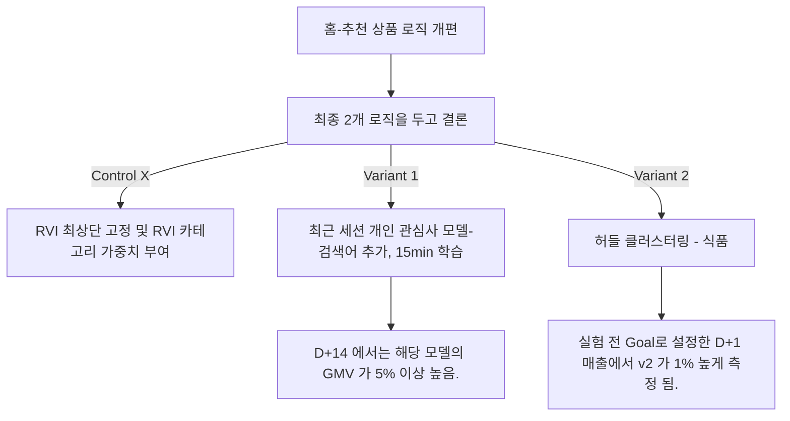

# 홈 - 아이템 추천 개편

## 가설: 노트북이나 티비와 같이, 고관여 상품이 GMV가 높고
        관심 가중치 모델에 결과로 자주 등장하는데,
        이 효과를 인정 받지 못한 이유는, 지표 기간 자체가 짧기 때문이다.

  

* 분석 전 정황: 관심 가중치 보다, 식품 클러스터링 모델의 효과가 좋은데, 진정 좋은 것인가 의문.

  
  
* 데이터 분서 진행
  * 카테고리 별 분기
  * D+1 ~ D+ 14 까지 구매금액에 대한 히트맵을 작성

  

  

* 결과
  * 관심 모델은 구매금액이 큰 편이고, 통계적으로 유의미하게 방문객 1인당 매출 총액이 앞섬.
    * But 사전 선정된 Goal 이 아님.
  * 허들 클러스터링은 1%p 높게 나타났으나, 통계적으로 유의미한 결과는 아니었음.
  * 따라서, 분석팀은 관심사 모델이 통계적으로는 조금 더 우세하다고 판단.
  * 전략적으로는 분석팀 내에서도 의견이 갈림.

* 추후 의결에 대한 초점
  * 구매금액이 큰 로열티 고객을 추구할 것인지,
  * 아니면 구매금액이 다소 작더라도 자주 오는 고객을 추구할 것인지에 대한 판단.
  
* 본부장님의 결정.  
  * 그룹사의 성과보고 요청으로 실험을 더 길게 할 수 없었고,
  * 해당 실험은 허들 클러스터링 모델의 승리로 실험 종료.