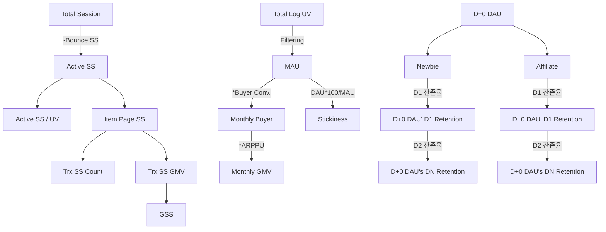

# 이커머스 지표 관계도

## B2C 커머스의 주요 지표 관계를 나타내봄

  

* Session(Product Funnel), Buyer(User & GMV), Retension(Vision) 3가지 초점에서 지표 형성

  

  

* Session Base - 제품 검증 지표 
  * Flow 는 여정 1단위에 따라, 우리가 쌓은 본 제품이 건강한지를 확인 할 수 있음.

* User Base - 현 상황 검증 지표
  * Platform의 재무적 가치를 대변하기에 용이함.

* Retension - 미래 비전 검증 지표
  * Platform의 비전과 성장가능성을 보여주기에 용이함.