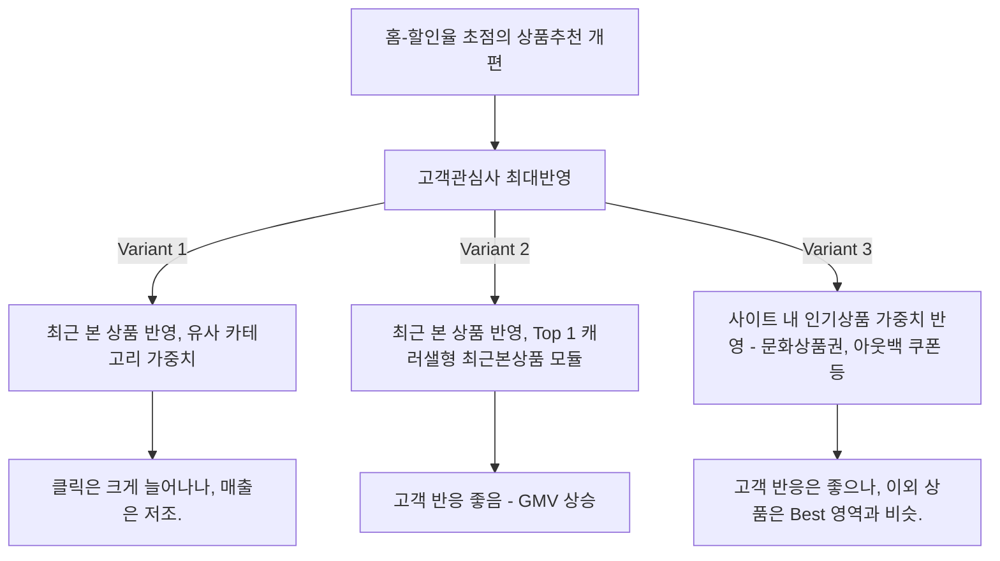

# 홈 - 아이템 추천 개편

## 가설: 유저가 관심있는 상품을 추천하면, 기존 높은 할인율보다 성과가 좋을 것이다.

  

* 분석 전 정황: 기존 영업에서 규모의 경제를 통해 높은 할일율을 보장하던 홈-지면 상품

  
  
* Variant 1 : 만약 유저가 최근에 열람한 카테고리에 가중치를 주어 상품을 재정렬 하면 효과가 좋지 않을까?
* Variant 2 : 만약 지면 최상단에 아예 최근본상품 모듈을 넣으면 효과가 좋지 않을까? 
* Variant 3 : 인기 상품 - 문화상품권, 아웃백 쿠폰 등 많은 사람들이 해당 시간에 좋아하면 더 잘팔리지 않을까?

  

  

* 관심상품에 대해 CTR 이 늘어나는 현상은 허수일 수 있음.
  * 마치 아저씨들이 낚시대를 만지작 거리듯,
  * 여성분들이 핸드백을 구경하는 것처럼
  * 클릭(반응)은 많을 수 있으나, 매출로 연결이 어려움.

* Variant 2 의 최상단에 모듈 고정하는 것을 위너로 선정하며 배포.