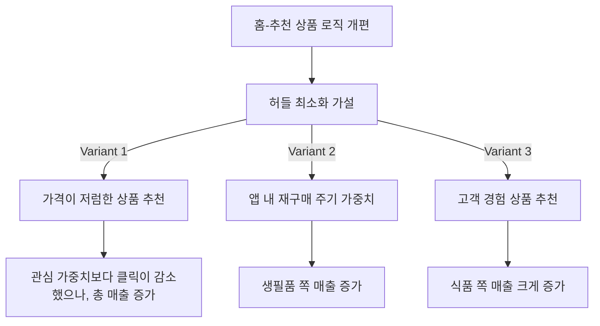

# 홈 - 아이템 추천 개편

## 가설: 홈 상품 추천 지면에 고객이 기대하는 바는, 낮은 허들일 것이다.

  

* 분석 전 정황: 관심 상품에 대한 이전 실험에서 매출이 증가하기는 했지만, 기대했던 수준보다는 저조.

  
  
* Variant 1 : 가격이 저렴한 상품을 보여주면 고객이 더 쉽게 살 수 있지 않을까?
* Variant 2 : 앱 내 재구매 주기가 돌아온 상품들을 보여주면 구매할 가능성이 높지 않을까?
* Variant 3 : 오프라인을 포함하여, 이미 경험이 있는 상품을 보여주면 전환이 잘 되지 않을까?

  

  

* 변형군 모두 효과가 있는 것으로 판단
  * 이후 추천 가중치에 각 Variant 의 이점들을 잘 녹여서
  * 매출 최적화 완료

* 결국, 홈-추천을 이용하는 사람들의 본 마음은
  * 크게 찾는 물건이 없는 상태에서
  * 이미 경험한 제품에 대하여
  * 적정한 가격에서 소비하고 싶은 것으로 확인.