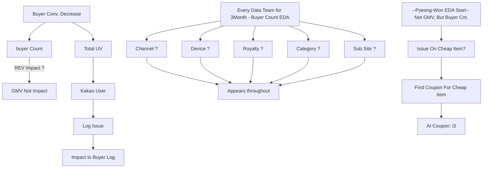

# 홈 - 아이템 추천 개편

## 가설: 유저가 관심있는 상품을 추천하면, 기존 높은 할인율보다 성과가 좋을 것이다.

* 조사 전 정황: 기존 영업에서 규모의 경제를 통해 높은 할일율을 보장하던 홈-지면 상품
  
* Variant 1 : 만약 유저가 최근에 열람한 카테고리에 가중치를 주어 상품을 재정렬 하면 효과가 좋지 않을까?
* Variant 2 : 만약 지면 최상단에 아예 최근본상품 모듈을 넣으면 효과가 좋지 않을까? 
* Variant 3 : 현금성 상품 (문화상품권, 아웃백 쿠폰) 등의 관심유저는 무조건 적 재구매를 하지 않을까? 

  

  
* 결국, 이슈는 22년 1월에 고장난 AI 쿠폰이 원인이었고, 1달간 고장난 이슈는 고쳐졌으나,
  * 해당 기간에 어그러진 데이터를 학습하여 균형 할인율을 잘못맞추던 것이었음.
  * 마침 그 시점에 담당자가 퇴사하며, 해당 프로덕은 이상이 없는 것으로 인지하고 있었음.

* 해당 사건으로 지마켓은 약 5개월 간 1천억에 가까운 매출을 놓치고 있었고.
  * 이후 본부별로 특정 KPI 만 바라보기 보다는 매출과 구매자를 동시에 놓고 보는 것으로 재조율 됨.