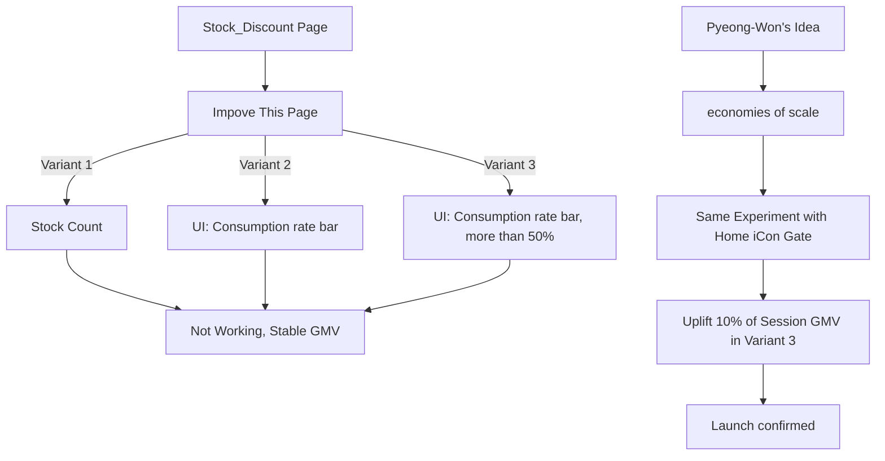

# 쿠팡 - 재고창고 지면 개편

## 가설: 창고할인 페이지에서 고객의 할인인지를 개편할 수 있다면, 보다 많은 매출을 증대시킬 수 있지 않을까?

  

* 조사 전 정황: 골드박스 유입자가 많은 가운데, 골드박스 영역 상단 마지막 탭에 있는 창고할인 페이지 성과 저조
  
* Variant 1 : 남은 수량을 보여주는 UI
* Variant 2 : 소진율 Bar 를 보여주는 UI
* Variant 3 : 50% 이상 소진 되었을 때, 소진율을 보여주는 UI

  

  
* 결국, 타임할인 페이지의 본질은 고객이 할인에 대한 기회가 사라질지 모른다는 것을 자극해야 하고.
  * 이를 만들어주기 위해서는 트래픽의 규모가 무조건 필요한 것.
  * 그래서 첫번째 실험을 통해 사라질 뻔 하였던 
  * 쿠팡의 타임할인 제품은 현재까지도 잘 운영되고 있습니다.
