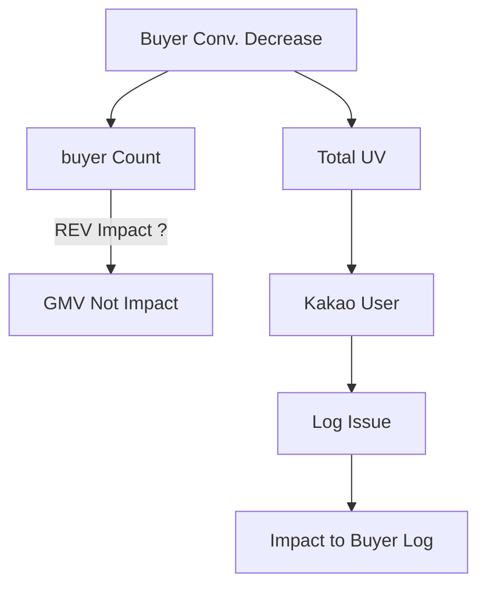

# 쿠팡 - 재고창고 지면 개편

## 가설: 창고할인 페이지에서 고객의 할인인지를 개편할 수 있다면, 보다 많은 매출을 증대시킬 수 있지 않을까?

  

* 조사 전 정황: 골드박스 유입자가 많은 가운데, 골드박스 영역 상단 마지막 탭에 있는 창고할인 페이지 성과 저조
  
* Variant 1 : 남은 수량을 보여주는 UI
* Variant 2 : 소진율 Bar 를 보여주는 UI
* Variant 3 : 50% 이상 소진 되었을 때, 소진율을 보여주는 UI

  

  
* 결국, 이슈는 22년 1월에 고장난 AI 쿠폰이 원인이었고, 1달간 고장난 이슈는 고쳐졌으나,
  * 해당 기간에 어그러진 데이터를 학습하여 균형 할인율을 잘못맞추던 것이었음.
  * 마침 그 시점에 담당자가 퇴사하며, 해당 프로덕은 이상이 없는 것으로 인지하고 있었음.

* 해당 사건으로 지마켓은 약 5개월 간 1천억에 가까운 매출을 놓치고 있었고.
  * 이후 본부별로 특정 KPI 만 바라보기 보다는 매출과 구매자를 동시에 놓고 보는 것으로 재조율 됨.