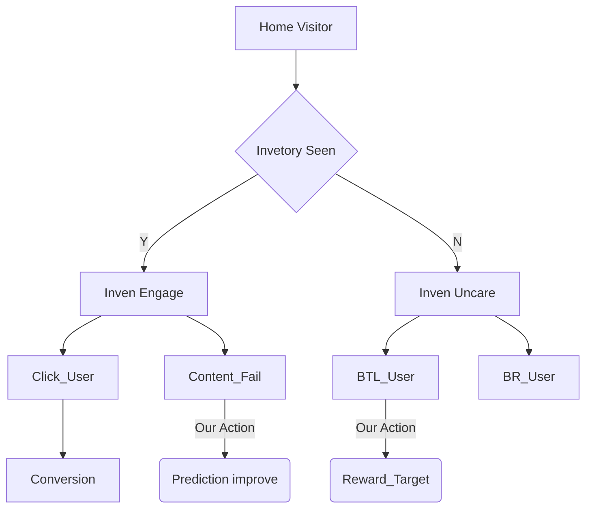

# 홈 최상단 배너 실험 - 매출모드

## 가설: 매출향 서비스 부스팅과, Fill-Rate 상승은 유저 불편을 과도히 야기하는가?

* 현 K % 노출율을 갖고 있는 최상단 구좌는 적정 노출율을 갖고 있는지 검증 필요.
  
* pCTR 이 추론되지 않는, 즉 데이터가 별로 없는 고객의 경우, 
  * 내부광고 노출에서 제외하는데 이를 제외하지 않을 경우에 
  * 매출이 X % 가까이 늘어나고, CTR 이 Y % 에서 Y/2 로 감소한다.

* 팀 내에서는 이 CTR 의 저하가, 고객경험의 파손으로 생각하고 있으나, 
  * 이는 온전히 고객경험 파손이 아니라,
    * 구좌무관심자의 분모 왜곡으로 지표가 어그러진 것.
    * 매출향 서비스의 노출 구성비율이 늘어나면서 지표왜곡
    * 실제로 소재 미매칭자의 불편도가 소폭 상승
      * 해당 건은 X버튼을 통해서 트래킹.

  

* 실제로 내부광고 Close 버튼을 탑재하여 불만족도를 조사하였을 때,
  * Fill-Rate를 상승시키는 것은 불만족도를 크게 높이지 않음.
  * 이를 유저 로열티로 분리할 시, 로열 고객에 한하여 
  * Close 버튼의 상승률이 Fill-Rate 상승과 함께 감.

* 해당 내용에 대한 추가적인 지표 검증
  * 구좌 노출자에 대한 재방문율 검증 >> 이상 없음
  * 구좌 노출자에 대한 사이트 전체 GMV 확인 >> 이상 없음
  * 구좌 노출자의 BTL 영역 GMV Impact >> 이상 없음
  * X 버튼의 사유 레이어를 넣어 드릴 다운
    * 사유의 대부분은 소재 무관심
    * X 버튼 미응답자는 구좌 무관심으로 판단
      * 이를 검증하기 위한 추가 수단 >> 최근 2달 내 구좌를 1번이라도 클릭한 집단과 아닌 집단으로 나누어 X버튼 추이 관찰
        * 대부분의 X 버튼 사용자는, 2달 내 한번이라도 클릭한 사람이 부정 피드백을 이용.
  * 실험을 통해 확인된 얻은 것, 20% 매출 상승
  * 실험을 통해 확인된 잃을 것, X버튼의 클릭률이 1.1% 에서 1.2% 로 소폭 증가.

* Action Plan
  * 기존 보다 Fill-Rate를 소폭 늘려서 운영.
  * 부정피드백을 해준 유저는 즉각적 조치를 할 수 있게 UX 개선