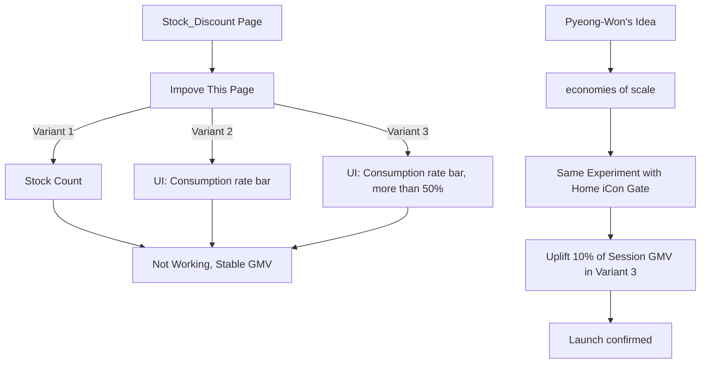

# CP - 재고창고 지면 개편

## 가설: 창고할인 페이지에서 고객의 할인인지를 개편할 수 있다면, 보다 많은 매출을 증대시킬 수 있지 않을까?

  

## 비지니스 적 정황 (Situation)
* 이커머스에서 성공하기 위해서는 3가지 USP 관점에서 대게 성공함.
  * 물류: 대규모 투자를 통해 물류 시스템 구축 완료
  * 상품다양성: 물류를 통한 구매자가 늘어남에 따라, 셀러들이 쿠팡 플랫폼을 선택할 수 밖에 없도록 만들었음.
  * 가격할인 정도와 이에 대한 브랜딩.
    * 셀러 간 경쟁을 통해 저가 상품을 드라이브 하고 있지만, 타 사이트와 가격차이가 크게 나지 않음.
      * 고객들이 할인을 많이 받았다고 느끼지 못함. >> 비싸도 빠르니까, 필요할때만 써야지.
        * 가격에 대한 매력도를 높이는 것이 비지니스 전략적 관점에서 필요했음.

## 행동 (Behavior)
* 가격을 가장 효율적으로 가져올 수 있는 상품군을 모색 >> 재고 창고
  * 재고 창고를 리브랜딩 해서, 고객들이 정말 괜찮은 가격이라고 느끼는 지면을 만들어보자
    * 타임딜 이라고 하는 지면을 만들고, 희소성과 저가를 강조하여 고객 브랜딩 및 재고상품 판매를 촉진해보자.

  * 실질적인 Action --> 재고창고 지면 개편 실험
    * Variant 1 : 남은 수량을 보여주는 UI
    * Variant 2 : 소진율 Bar 를 보여주는 UI
    * Variant 3 : 50% 이상 소진 되었을 때, 소진율을 보여주는 UI

  

  

## 효과 ( Impact )
  * 결국, 타임할인 페이지의 본질은 고객이 할인에 대한 기회가 사라질지 모른다는 것을 자극해야 하고.
    * 이를 만들어주기 위해서는 트래픽의 규모가 무조건 필요한 것.
    * 그래서 첫번째 실험을 통해 사라질 뻔 하였던 
    * 쿠팡의 타임할인 제품은 현재까지도 잘 운영되고 있습니다.
