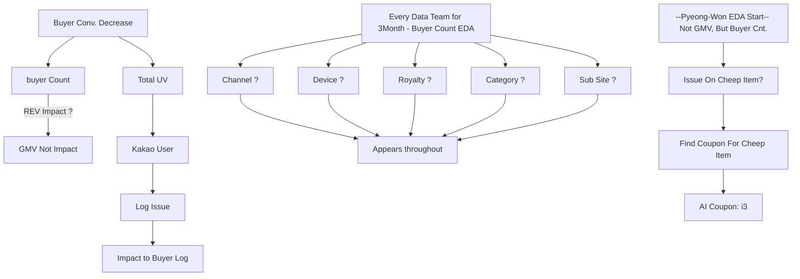

# Buyer Conversion 점진적 감소 원인

## 가설: 매출에서는 큰 임펙이 없는데, 구매자가 크게 줄고 있음.

* 조사 전 정황: Buyer Conv.가 크게 줄고 있으나, 3개월 간 원인 불명확.
  
* 영업본부: 기간 중 매출에서는 큰 저해함이 없음.
* 마케팅본부: 이벤트나 외부채널 전략 변경 등이 없는데 Buyer 감소.
* 테크본부: 분모인 Traffic 이 간편가입이 생기면서 로그 집계이슈일 것
  * 이에 따라 감소하는 분자도, 분모에 연결된 누실일 가능성이 큼.

  

  
* 결국, 이슈는 22년 1월에 고장난 AI 쿠폰이 원인이었고, 1달간 고장난 이슈는 고쳐졌으나,
  * 해당 기간에 어그러진 데이터를 학습하여 균형 할인율을 잘못맞추던 것이었음.
  * 마침 그 시점에 담당자가 퇴사하며, 해당 프로덕은 이상이 없는 것으로 인지하고 있었음.

* 해당 사건으로 지마켓은 약 5개월 간 1천억에 가까운 매출을 놓치고 있었고.
  * 이후 본부별로 특정 KPI 만 바라보기 보다는 매출과 구매자를 동시에 놓고 보는 것으로 재조율 됨.