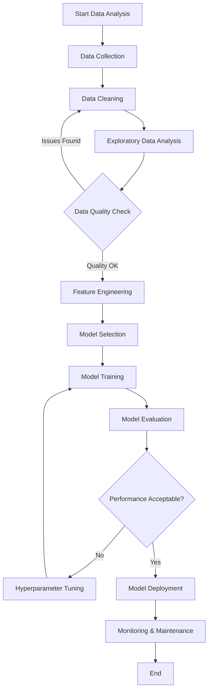
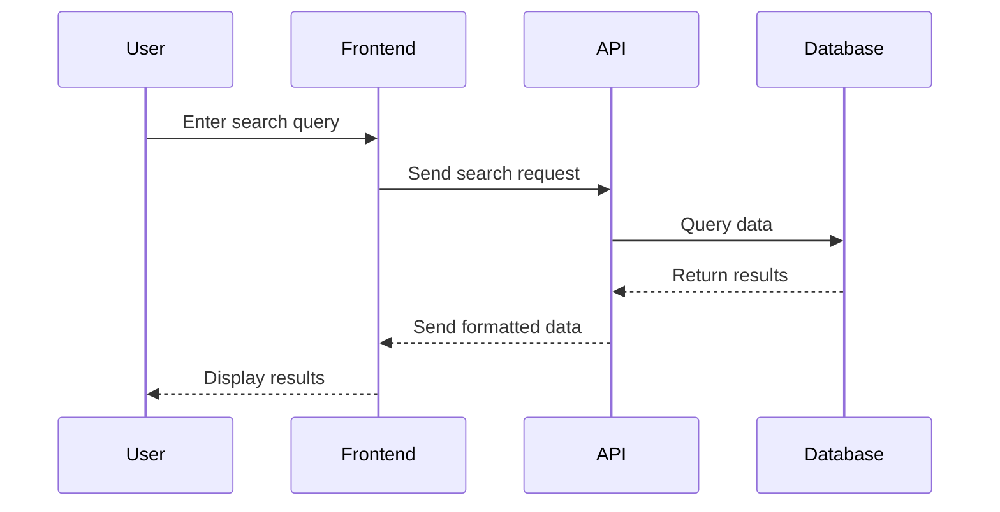
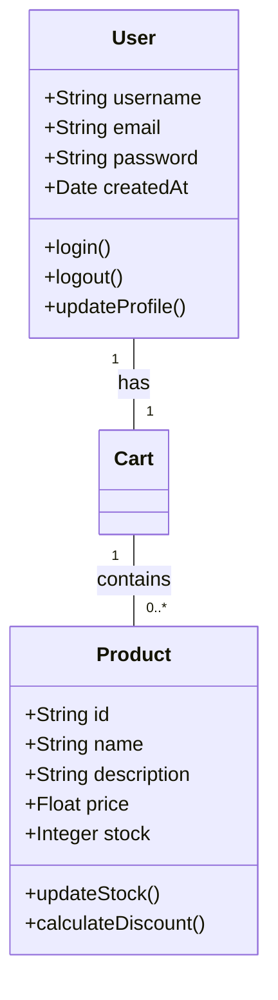

# Mermaid 다이어그램 예제

## 1. 데이터 분석 워크플로우

```mermaid
flowchart TD
    A[Start Data Analysis] --> B[Data Collection]
    B --> C[Data Cleaning]
    C --> D[Exploratory Data Analysis]
    D --> E{Data Quality Check}
    E -->|Issues Found| C
    E -->|Quality OK| F[Feature Engineering]
    F --> G[Model Selection]
    G --> H[Model Training]
    H --> I[Model Evaluation]
    I --> J{Performance Acceptable?}
    J -->|No| K[Hyperparameter Tuning]
    K --> H
    J -->|Yes| L[Model Deployment]
    L --> M[Monitoring & Maintenance]
    M --> N[End]
```

## 2. 웹 애플리케이션 시퀀스 다이어그램

```mermaid
sequenceDiagram
    participant User
    participant Frontend
    participant API
    participant Database
    
    User->>Frontend: Enter search query
    Frontend->>API: Send search request
    API->>Database: Query data
    Database-->>API: Return results
    API-->>Frontend: Send formatted data
    Frontend-->>User: Display results
```

## 3. 클래스 다이어그램

```mermaid
classDiagram
    class User {
        +String username
        +String email
        +String password
        +Date createdAt
        +login()
        +logout()
        +updateProfile()
    }
    
    class Product {
        +String id
        +String name
        +String description
        +Float price
        +Integer stock
        +updateStock()
        +calculateDiscount()
    }
    
    User "1" -- "1" Cart : has
    Cart "1" -- "0..*" Product : contains
``` 