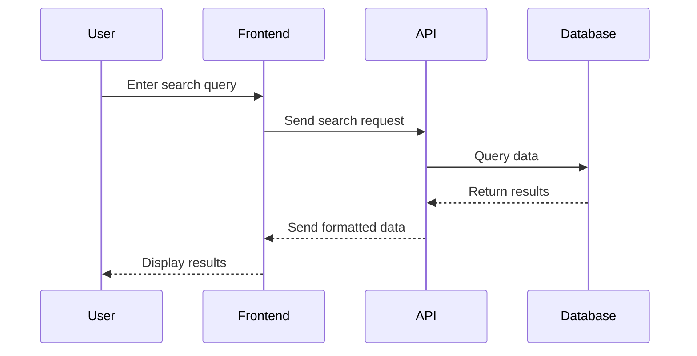

# Mermaid 다이어그램 예제

## 웹 애플리케이션 시퀀스 다이어그램

```mermaid
sequenceDiagram
    participant User
    participant Frontend
    participant API
    participant Database
    
    User->>Frontend: Enter search query
    Frontend->>API: Send search request
    API->>Database: Query data
    Database-->>API: Return results
    API-->>Frontend: Send formatted data
    Frontend-->>User: Display results
```
