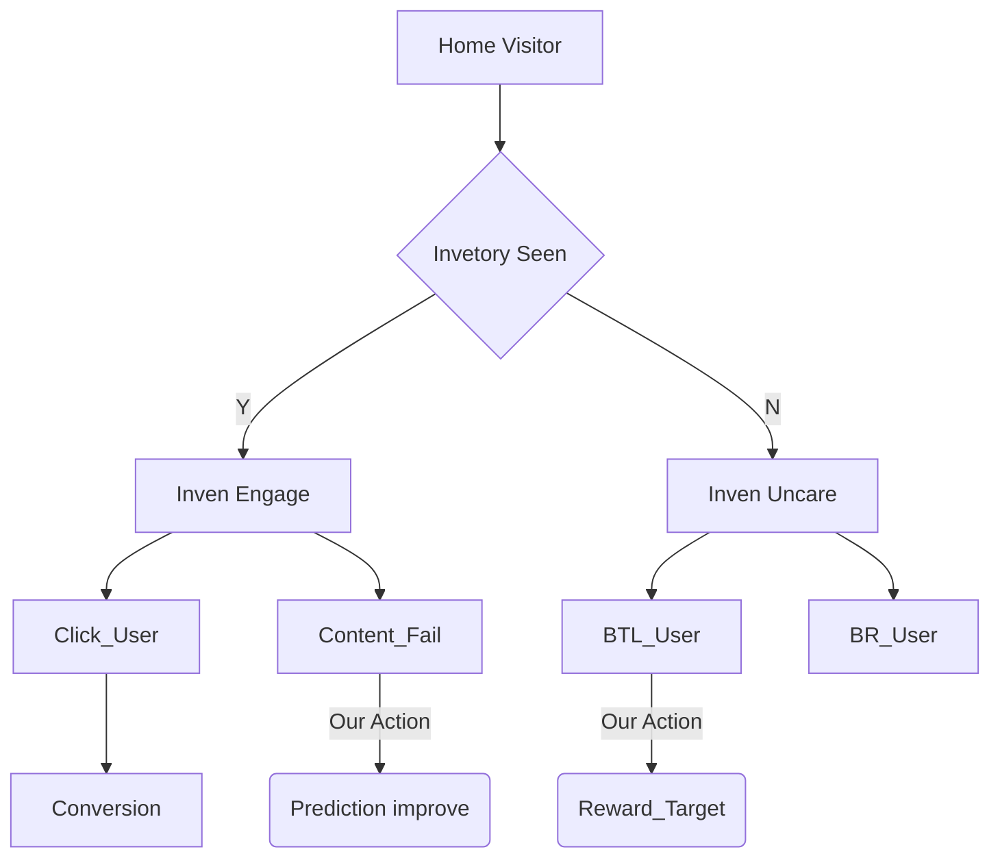

# 홈 최상단 배너 실험 - 매출모드

## 가설: 최상단 내부광고의 현 Fill-Rate는 온당한가?

* 현 K % 노출율을 갖고 있는 최상단 구좌는 적정 노출율을 갖고 있는지 검증 필요.
  
* pCTR 이 추론되지 않는, 즉 데이터가 별로 없는 고객의 경우, 
  * 내부광고 노출에서 제외하는데 이를 제외하지 않을 경우에 
  * 매출이 X % 가까이 늘어나고, CTR 이 Y % 에서 Y/2 로 감소한다.

  

* 팀 내에서는 이 CTR 의 저하가, 고객경험의 파손으로 생각하고 있으나, 
  * 이는 구좌무관심자의 분모 왜곡으로 지표가 어그러진 것.
  
* Uncare_BTL 유저 대상
  * User 로열티로 구분한 뒤 ( 최근 1달 이내 배너 클릭 유저 YN )
  * 실험군 별로 홈 아래영역 매출 비교해보았을 때, 차이가 나지 않음.
  * 즉, 구좌 무관심자에게 구좌를 노출한 것이 No Harm 이라는 결론.

* 실제로 내부광고 Close 버튼을 탑재하여 불만족도를 조사하였을 때,
  * Fill-Rate를 상승시키는 것은 불만족도를 높이지 않음.
  * 이를 유저 로열티로 분리할 시, 로열 고객에 한하여 
  * Close 버튼의 상승률이 Fill-Rate 상승과 함께 감.