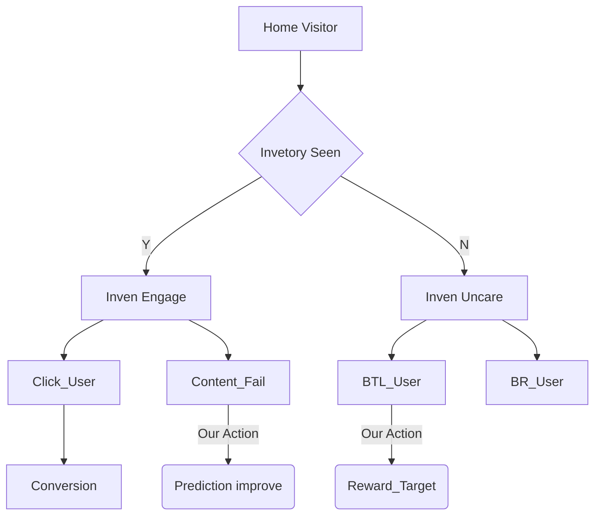

# Mermaid 다이어그램 예제

## 데이터 분석 워크플로우

```mermaid
flowchart TD
    pv[Home Visitor] --> intel_pv{Invetory Seen}
    intel_pv --> |Y| intel_imp[Inven Engage]
    intel_imp --> Click_User[Click_User]
    Click_User --> Conv_User[Conversion]

    intel_imp --> Non_Ck[Content_Fail]
    Non_Ck --> |Our Action| pCTR(Prediction improve)
    

    intel_pv --> |N| intel_uncare[Inven Uncare]
    intel_uncare --> BTL[BTL_User]
    intel_uncare --> BR[BR_User]
    BTL --> |Our Action| Promo(Reward_Target)


```
