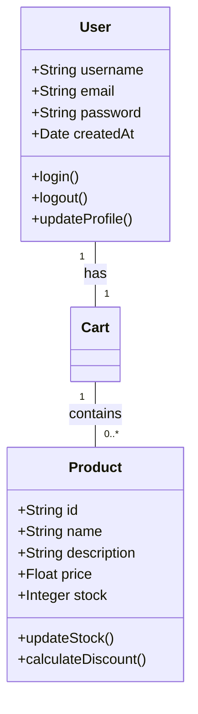

## 클래스 다이어그램

```mermaid
classDiagram
    class User {
        +String username
        +String email
        +String password
        +Date createdAt
        +login()
        +logout()
        +updateProfile()
    }
    
    class Product {
        +String id
        +String name
        +String description
        +Float price
        +Integer stock
        +updateStock()
        +calculateDiscount()
    }
    
    User "1" -- "1" Cart : has
    Cart "1" -- "0..*" Product : contains
``` 